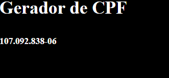

# Generator cpf with babel

## Projeto voltado para estudo das configurações de babel, estudo de processo de geração de build utilizando webpack, core-js, css-loader para carregamento de css, style-loader e outras dependências.

## Basicamente ao dar reload na página, será gerado um novo cpf em tela. Um projeto simples, mas com foco em estudo no processo de geração de bundle utilizando webpack.
